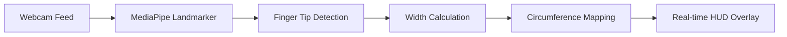

# 🖐️ Finger Circumference 


A computer vision-based Proof of Concept (POC) for estimating finger circumference in real-time. This project leverages Google's MediaPipe Hand Landmarker for sub-pixel tracking and OpenCV for dynamic visual overlays, specifically designed for digital ring-sizing applications.

---

## 🏗️ How it Works

The system uses the following pipeline to estimate measurements:



---

## 🚀 Features

*   **Sub-pixel Accuracy:** High-fidelity landmark detection for precise finger positioning.
*   **Multi-Finger Tracking:** Detects and measures all five fingers simultaneously.
*   **Real-time HUD:** Live display of estimated circumference in centimeters.
*   **Screenshot Utility:** Capture and save processed frames with a single keystroke.
*   **Modular Design:** Separate logic for detection and geometric measurement.

---

## 🛠️ Setup & Installation

### 1. Environment Setup
```bash
# Navigate to project
cd finger_poc

# Set up virtual environment
python3 -m venv .venv
source .venv/bin/activate

# Install dependencies
pip install -r requirements.txt
```

### 2. Model Asset
This project requires the `hand_landmarker.task` file.
*   **Automated Fix:** I have already downloaded this to your folder!
*   **Manual Download:** If missing, get it from [MediaPipe Models](https://storage.googleapis.com/mediapipe-models/hand_landmarker/hand_landmarker/float16/1/hand_landmarker.task).

---

## 🖥️ Usage

Run the main POC:
```bash
python3 app.py
```

### Controls:
| Key | Action |
| :--- | :--- |
| `q` | Quit the application |
| `s` | Save a screenshot to the current directory |

---

## 📂 File Structure

*   `app.py`: Main application loop and webcam handler.
*   `detector.py`: MediaPipe HandLandmarker implementation.
*   `measurement.py`: Geometric calculations for circumference estimation.
*   `requirements.txt`: Project dependencies.

---

## ⚖️ License
MIT License
